# ConvolutionPara.
Parallel Computing Final Project: Convolution Speedup.
> 使用echarts 完成图表绘制

# OpenMP测试

*使用OpenMP共实现了三个版本（Origin, O_1以及O_2），并有两项测试：Ntest 以及 ThreadTest*。

*对每个单个测试运行五次取平均值为结果。考虑到机器散热以及其它问题，可能会有个别点有较大的波动，原因是运行时间太短，导致小的干扰也被放大，可以当作噪点看待。*

*测试为大小M=3的卷积核对矩阵进行卷积操作，并重复100000遍，以得到相对准确的时间。*


## 0. 算法说明

### Origin

仅仅是将串行算法进行了并行化，也就是只是简单的使用多个核（线程）运行。

```c
#pragma omp parallel for num_threads(thread_count)
        for (int cur_y = 0; cur_y < dim; ++cur_y)
        {
            for (int cur_x = 0; cur_x < dim; ++cur_x)
            {
                outputMatrix[cur_y][cur_x] = conv(cur_x, cur_y);
            }
        }
    }
```

### O_1

从**计算机的角度**考虑了如下问题：

1. CPU 寄存器是否有很好的利用
2. 对于64位的现代CPU，有没有什么需要注意的点？
3. 是否可以省去一些不必要的时间（例如上下文切换）

* 遵循大胆质疑小心求证的原则，首先确认了第二点，也就是针对64位CPU有没有什么需要注意的点。主要原因是发现如果在for循环中`int`类型和`size_t`类型混用，会导致性能下降。检索后得到结论：

  > `signed` usually leads to the same or **worse** performance. Performance degradation happens when you assign a result of an arithmetic operation (which is usually, never) to a variable of type, which is stored in the processor's register (which is also of type). All the conversions from to take time and are annoying.

  并且，对于现代64位CPU，似乎使用64位的类型以填满CPU寄存器会略微提升性能（或者说不损失性能），也许和CPU寄存器的使用和调度有关。所以我们选择在`for`循环的判定中使用`size_t`类型。

* 然后针对第一点和第三点，我选择对所有关键的，反复使用的变量使用`register`关键字修饰，以得到最佳性能，并且将原本卷积的函数调用直接改成了运算，省去了函数调用的时间。

```c
#pragma omp parallel for num_threads(thread_count)
        for (register size_t cur_y = 0; cur_y <= N - M; ++cur_y)
        {
            register size_t cur_x, i, j;
            register int sum;
            for (cur_x = 0; cur_x <= N - M; ++cur_x)
            {
                sum = 0;
                for (i = 0; i < M; ++i)
                {
                    for (j = 0; j < M; ++j)
                    {
                        sum += matrix[cur_y + i][cur_x + j] * core[i][j];
                    }
                }
                outputMatrix[cur_y][cur_x] = sum;
            }
        }
```

### O_2

选择使用*im2col + GEMM*算法优化卷积。

卷积计算的输入从二维的矩阵到四维张量，以及卷积核从二维矩阵到四维矩阵都对应不同大小的输出，最后会统一到一个算法里面，这里用一个函数来表示：

$a=conv(x,k)$

$x $是输入，$ k$ 是卷积核， $a $是卷积的结果，即特征图（feature map），先看输入和卷积核都是矩阵的情况：

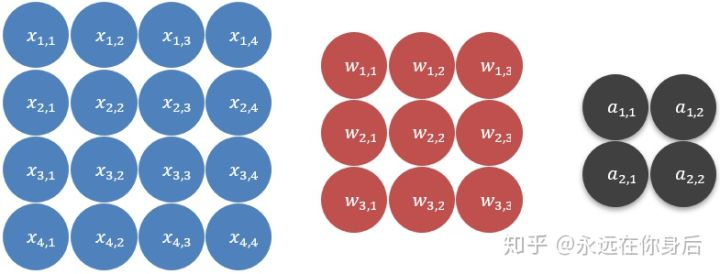

上图中蓝色的为输入，红色的是卷积核，灰色是结果

卷积的过程就是，将输入划分成若干个**与卷积核相同大小**的不同子集，再分别与卷积核点乘：

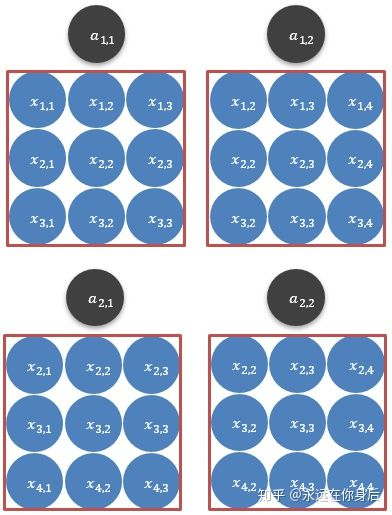

如上图所示，本栗子的输入可以划分为4个子子集（为什么是4个，这里涉及一个步长的变量，后面讨论），将它们各自与卷积核点乘，得到的结果就是红框上面的输出

现在，将上述的过程用公式向量表示，就拿第一个子集（将其表示为 x(1) ）来说吧：

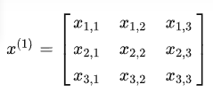

然后将其展开，变成一个行向量：

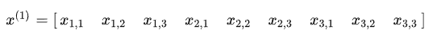

对这四个子集都进行同样的操作，然后并在一起得到一个**矩阵**：

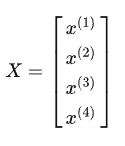

同样的，再将卷积核如法炮制，只不过这次是展开成**列向量**：

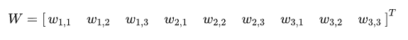

然后将 X,W 相乘，得到：

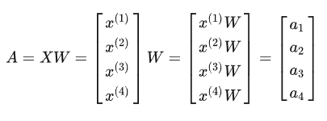

最后将A变形，就得到了卷积的结果：

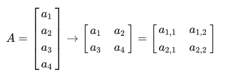

以上，就是输入和卷积核都是矩阵时的情况，用一个公式总结一下：

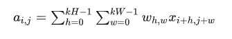

$kH，kW$是卷积核的宽和高，不过这里是下标是从0开始的。也就是说通过*im2col*可以将卷积转换成通用矩阵乘。而通用矩阵乘可以通过提高对输入的重用、大量使用寄存器等方法优化计算速度：

将输出的计算拆分为 1×4 的小块，即将 维度拆分为两部分。计算该块输出时，需要使用 矩阵的 1 行，和 矩阵的 4 列。

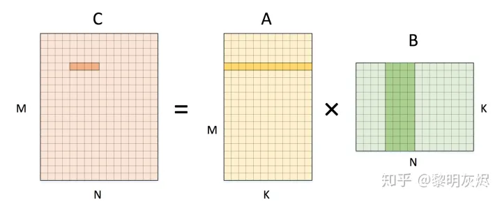


## 1. NTest

*取thread_num=16*

1. 时间比较：


三条线代表三个版本，横轴为矩阵规格N，纵轴为时间，线条位置越靠下代表性能越好。

2. 加速倍率比较：

.png)

纵轴代表加速比率（相对于串行），线条位置越靠上代表性能越好；

可以看到使用*im2col + GEMM*的最终版本相比原版本加速了约$ 50\% $，还是非常可观的。

3. 效率比较：


可见*Efficiency*随着N的增大而增大，增速不断放缓。


## 2. ThreadTest

*取N=97*

1. 时间比较：

.png)

横轴为线程数，纵轴为运行时间，线条位置越靠下代表性能越好。可以看到运行速度随着线程数的增加而加快，并且速度不断放缓。但在线程数大于16后出现了明显的边际效应，运行时间大幅增加，可能的原因是测试机器CPU为*8核16线程*，当线程数多于CPU线程数时会耗费大量时间进行调度。

2. 加速倍率比较：

-1671710149163-5.png)

横轴为线程数，纵轴为加速比率（相对于串行），线条位置越靠上代表性能越好。

3. 效率比较：


如图所示，纵轴为效率，横轴为线程数*N*，可见随着线程数的增加（小于等于16时），效率不断减小。

*O_1和O_2在一开始效率大于一的可能原因是算法本身改进，导致即使单线程运行也比原先未优化的算法效率高。*

由此可知该算法是*Weakly Scalable*的。


# Open MPI测试

*使用OpenMP共实现了三个版本（O_0, O_1以及O_2），并有两项测试：Ntest 以及 ThreadTest*。

*对每个单个测试运行三次取平均值为结果。考虑到机器散热以及其它问题，可能会有个别点有较大的波动，原因可能是运行时间太短，导致小的干扰也被放大，可以当作噪点看待。*

*测试为大小M=3的卷积核对矩阵进行卷积操作，并重复10000遍，以得到相对准确的时间。*

*另外，O_0版本因为算法原因，并行起来甚至会比串行还要慢，在测试中也可能会有奇怪的数据，可以忽略*

## 1. NTest

取*thread_num = 8*

1. 加速比率比较：

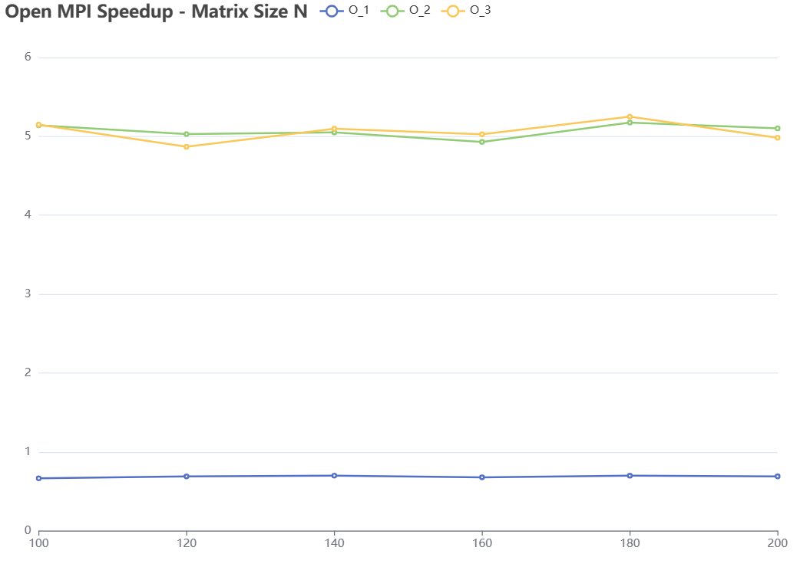

如图所示，横轴为矩阵大小N，纵轴为加速比率（相对于串行），线条位置越考上代表性能越好。

2. 效率比较：

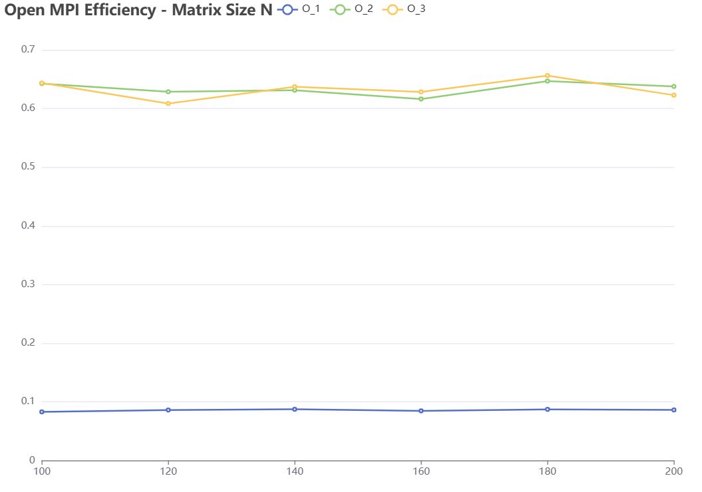

横轴为效率*Efficiency*，可见N对于固定的线程数来说影响不大。


## 2. ThreadTest

*取 N=150*

1. 加速比率比较：


如图所示，横轴为线程数，纵轴为加速比率（相对于串行）。

2. 效率比较：


如图所示，纵轴为*Efficiency*，可见随着线程数的增加，效率是不断降低的，所以可知算法是*Weakly Scalable*的。